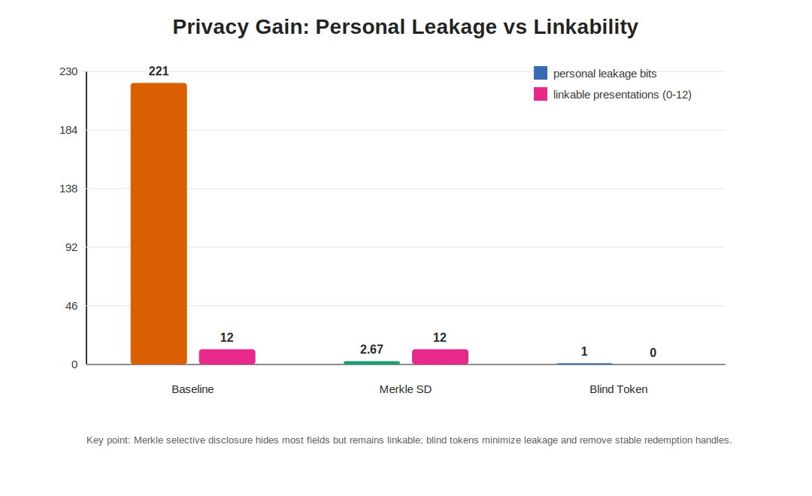
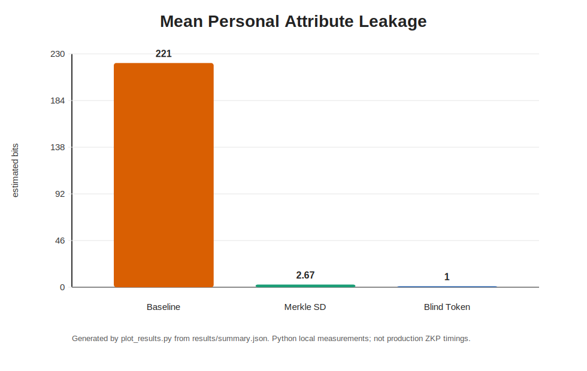
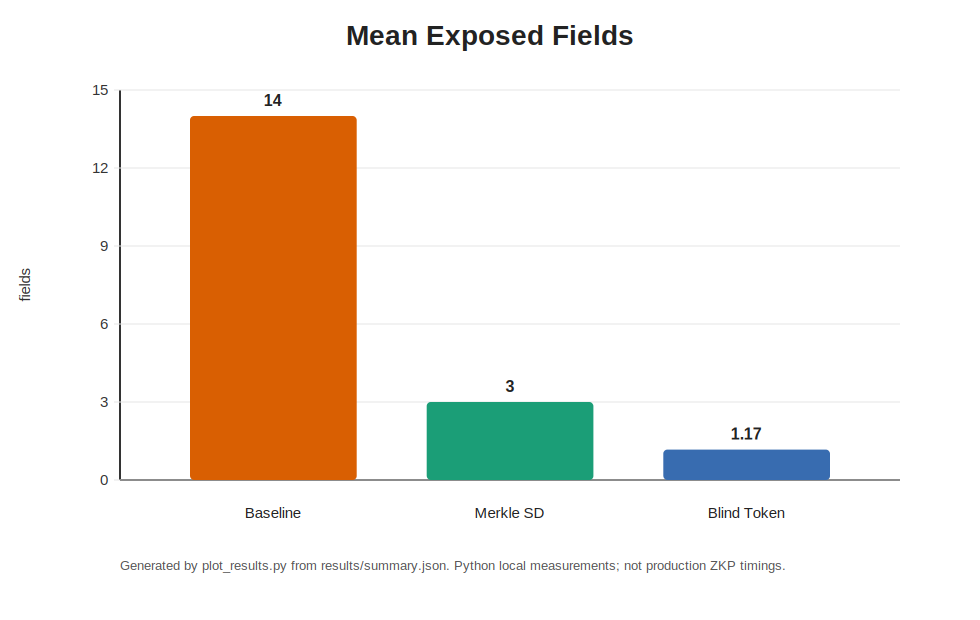
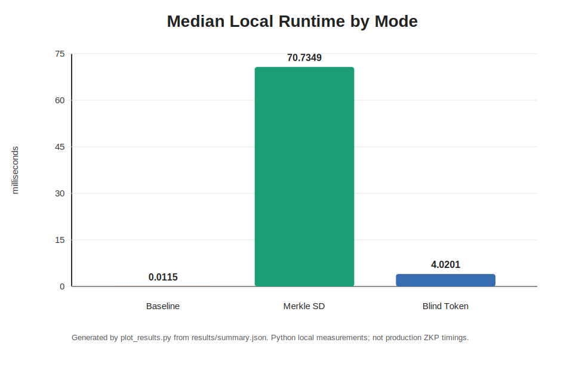

# Privacy-Preserving Authentication Experiment

This is a clean-room teaching prototype for the course paper:

> 隐私保护身份认证中的零知识证明与匿名凭证研究综述

The goal is to replace the earlier loose experiment with a reproducible project
that a teacher can run from a public repository. It does **not** copy code from
the original research repositories. It implements a small experimental model
that matches the paper's research idea:

- baseline authentication that reveals all identity fields;
- selective-disclosure credential presentation using a signed Merkle root;
- minimal-disclosure anonymous access tokens using a Privacy Pass-style blind
  RSA token;
- Schnorr NIZK proof for holder-key binding;
- revocation and replay checks;
- reproducible privacy and performance reports.

## Quick Start

No third-party Python packages are required.

```powershell
cd privacy_auth_experiment
python run_experiments.py
python plot_results.py
python -m unittest discover -s tests
```

Generated files:

- `results/summary.json`: machine-readable experiment output;
- `results/report.md`: paper-ready experiment report.
- `results/figures/*.svg`: SVG charts generated from the experiment output.

## Experiment Figures









## What This Prototype Proves

This prototype checks four things that are closer to the paper's claims than the
old script:

1. **Correctness**: baseline, selective disclosure, and blind-token modes make
   the same allow/deny decision for the same policy.
2. **Minimal disclosure**: the verifier sees fewer fields than in baseline
   authentication. The blind-token mode reveals only policy satisfaction and a
   single-use token.
3. **Revocation**: a revoked credential cannot mint new anonymous tokens.
4. **Unlinkability sanity check**: issued blind tokens are not directly
   linkable to redeemed tokens by the issuer in this toy model.

## What This Prototype Does Not Prove

This is not a production anonymous credential system:

- the Merkle selective-disclosure mode reveals a stable credential root and is
  therefore linkable across presentations;
- the blind-token mode proves policy eligibility only at token issuance time and
  does not support arbitrary hidden predicates;
- the RSA and Schnorr implementations are educational and lack side-channel
  defenses, standardized encodings, audited randomness, and formal proofs;
- the benchmark numbers are local Python measurements, not comparable to
  zk-creds, FIDO-AC, Coconut, or EL PASSO implementations.

Use the results as a disciplined course-paper prototype, not as a deployable
cryptographic library.

## Relationship to Open-Source Research Code

The project README and `docs/open_source_survey.md` record the upstream code
availability found during literature checking. Important examples:

- zk-creds: https://github.com/rozbb/zkcreds-rs
- FIDO-AC: https://github.com/FIDO-AC/fidoac
- Coconut: https://github.com/asonnino/coconut
- Delegatable AC implementation path mentioned by the paper:
  https://github.com/docknetwork/crypto/tree/main/delegatable_credentials

This local project is intentionally smaller and dependency-free so it can be
checked easily by a course teacher.
